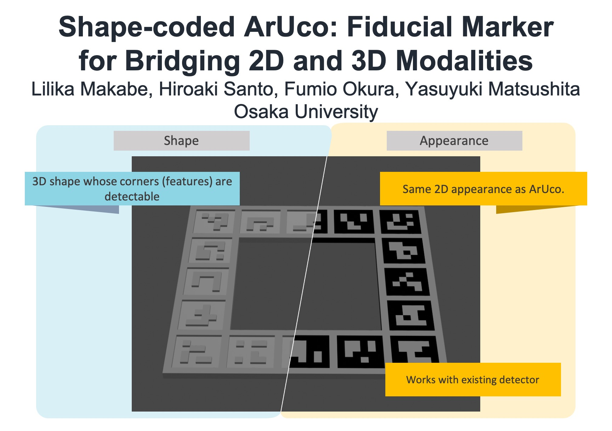

# Shape-coded ArUco: Fiducial Marker for Bridging 2D and 3D Modalities
This is the project page for our WACV2022 paper: "Shape-coded ArUco: Fiducial Marker for Bridging 2D and 3D Modalities".


*Abstract* - We introduce a fiducial marker for the registration of two-dimensional (2D) images
and untextured three-dimensional (3D) shapes that are recorded by commodity laser
scanners. Specifically, we design a 3D-version of the ArUco marker that retains
exactly the same appearance as its 2D counterpart from any viewpoint above the
marker but contains shape information. The shape-coded ArUco can naturally work
with off-the-shelf ArUco marker detectors in the 2D image domain. For detection
in the 3D domain, we develop a method for detecting the marker in an untextured
3D point cloud. Experiments demonstrate accurate 2D-3D registration using our
shape-coded ArUco markers in comparison to baseline methods.

[[paper]](http://cvl.ist.osaka-u.ac.jp/wp-content/uploads/2021/10/makabe2022wacv.pdf)

[[video]](https://www.youtube.com/watch?v=DcHXfaLgFAs&#41;)
[](https://www.youtube.com/watch?v=DcHXfaLgFAs)


coming soon...

```
@inproceedings{makabe2022wacv,
title = {Shape-coded ArUco: Fiducial marker for bridging 2D and 3D modalities},
author = {Lilika Makabe and Hiroaki Santo and Fumio Okura and Yasuyuki Matsushita},
year = {2022},
date = {2022-01-04},
booktitle = {IEEE/CVF Winter Conference on Applications of Computer Vision (WACV)},
keywords = {},
pubstate = {forthcoming},
tppubtype = {inproceedings}
}
```
